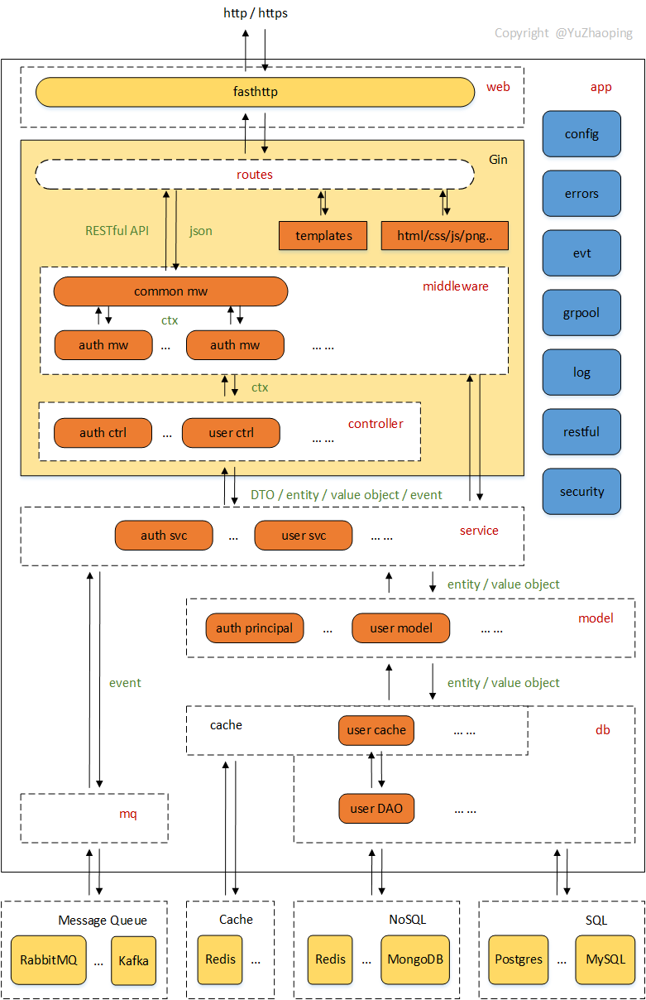

# Gin-MVC
The MVC framework based on [Gin](https://github.com/gin-gonic/gin).

The framework integrates MVC-developing patterns to build a RESTful web application (especially, micro-service application).

The framework is lightweight and flexible, easy to extend and configure, and additionally with essential facilities to build an enterprise level project. Especially, the project is issued as out-of-box. You could clone the project, rename the project's module name, and then start your business-logic developing work.

The project acts as a starter to build a real RESTful, MVC-style web application.

The framework's core runtime is based on the [Gin](https://github.com/gin-gonic/gin), [fasthttp](https://github.com/valyala/fasthttp) and [ants](https://github.com/panjf2000/ants) to process millions of concurrent requests.

## Usage

Clone the project:

```sh
mkdir -p ~/work/go & cd ~/work/go
git clone git@github.com:chinmobi/gin-mvc.git <your-project-name>

```

Change the project's module name:

```sh
cd ~/work/go/<your-project-name>
./change-mod.sh <github.com>/<your-account-name>/<your-project-name>
```

Discard the useless `.git` directory:

```sh
cd ~/work/go/<your-project-name>
rm -rf .git
```

Then the project is ready for developing your own RESTful MVC-web application.
<br/>To test the works properly:

```sh
cd ~/work/go/<your-project-name>
make build
./_deploy/entrypoint.sh
```
The web server is listening at `8080` port as default, use `http://localhost:8080/` to access the web server.
<br/>Use `Ctrl+C` to exit the web server.
<br/>Use `make clean` to clean the built objects.
<br/>Use `make` to build more complex targets.

## Project structure

* `app` - Application main context to load and provide app's components/utilities, also manage components/utilities' lifecycle (`Load, Setup/Start, Teardown/Shutdown, Release`).

* `config` - Load and set up configurations that used to set up app's components/utilities.

* `controller` - Define controller handers for handling requests.

* `db` - Manage data-store connections (`redis`, `mongodb`, `postgres`, etc...), and provide data access objects (DAOs) that used for `model`.

* `errors` - Define common errors and handling utility (Migrated to [ginmod/errors](https://github.com/chinmobi/ginmod)).

* `evt` - Provide event publish/listen/multicast utility (Migrated to [modlib/evt](https://github.com/chinmobi/modlib)).

* `grpool` - Provide goroutine pool utility (Migrated to [modlib/grpool](https://github.com/chinmobi/modlib)).

* `log` - Provide logging utility (Migrated to [modlib/log](https://github.com/chinmobi/modlib)).

* `middleware` - Define middleware handlers before `controller` handler while handling requests.

* `model` - Define business entities and models that used for `service`.

* `mq` - Manage and provide message queueing utilities (`rabbitmq`, `kafka`, etc...).

* `restful` - Utility to pack `RESTful API` response (Migrated to [ginmod/restful](https://github.com/chinmobi/ginmod)).

* `routes` - Map `RESTful API` URL path routes to `controller` handers.

* `security` - Security utility for authentication and authorization (Migrated to [ginmod/security](https://github.com/chinmobi/ginmod)).

* `service` - Define business services that used for `controller` and `middleware` handers.

* `tests` - Test cases for integration tests, especially for `controller` layer about RESTful APIs.

* `web` - Provide web server to run `app`.

## Best practices

1. First of all, analyze requirements and business rules, and then write use cases.

2. According to use cases, design [RESTful APIs](RESTful-APIs.md) that served for use cases.

3. Based on the RESTful APIs, design `controller` handers, and data transfer objects (DTOs) used for handlers.

4. Setup `routes` that map RESTful APIs' paths to `controller` handers.

5. According to domain-driven design's (DDD) principle, design business `model` entities and `service` interfaces to implement `controller` handers.

6. Complete `db` DAOs to implement `model` and `service` objects.

**IMPORTANT:**

* Following the agile development. All of steps can be and must be taking turns to develop, processing from iteration to iteration (step by step).

* Once someone has recognized some use cases, another one can design APIs and/or design business models/services simultaneously.

* Once someone has completed some APIs' design, another one can develop controller handlers and/or develop models/services and/or develop DAOs simultaneously, and so on.

## Starting process

The whole starting process of the framework consists of three stages: `app-setup` stage, `web-setup` stage and `start-run` stage.

* **The `app-setup` stage**

```
1. Load configure (`config`) that will be used for other components.
2. Setup logging (`log`) used for whole application.
3. Setup goroutine pool (`grpool`), the pool hasn't been activated yet.
4. Setup application event's utility (`evt`).
5-1. Load databases and cache (`db`) that providing DAOs.
5-2. Setup models (`model`) using DAOs.
6. Load message queuing utility (`mq`).
7-1. Setup services (`service`) using models (`model`).
7-2. Register event listeners and message queue consumers.
```

* **The `web-setup` stage**

```
1. Setup middlewares (`middleware`) with `config` and app services (`sevice`).
2. Setup controllers (`controller`) with app services (`sevice`).
3. Setup router path routes (`routes`) with middlewares and controllers.
```

* **The `start-run` stage**

```
1. Activate the goroutine pool.
2. Start http listening to serve for requests.
```

## Architecture



## About

Most of the design patterns and key concepts are refined from the [Spring Projects](https://spring.io/projects), the `Spring Framework`, `Spring MVC`, `Spring Security`, `Spring Data`, `Spring Boot`, etc.

As mature technology, the `Spring Projects` provides the best patterns and solutions to build enterprise level applications, especially the web, cloud, and micro-service products.

But the components and concepts about the `Spring` family technologies are huge, and much more flexible and configurable. It is hard to use the `Spring` technologies easily (especially for beginner), and the built projects are so heavy.

I (YuZhaoping) just refine the key thoughts of the `Spring` technologies to ensure the framework is light, but flexible and configurable to use, and more important, using the advanced features of `Golang` and `Gin`.

The project issuing as out-of-box style, is preferred to start the project immediately, not needed to do surrounding works to establish a real project. One aim of the project is to act as a starter using the best practices to build enterprise level applications.

## Authors

* **Zhaoping Yu** - *Initial work* - yuzhaoping1970@gmail.com

## License

This project is licensed under the MIT License - see the [LICENSE](LICENSE) file for details
